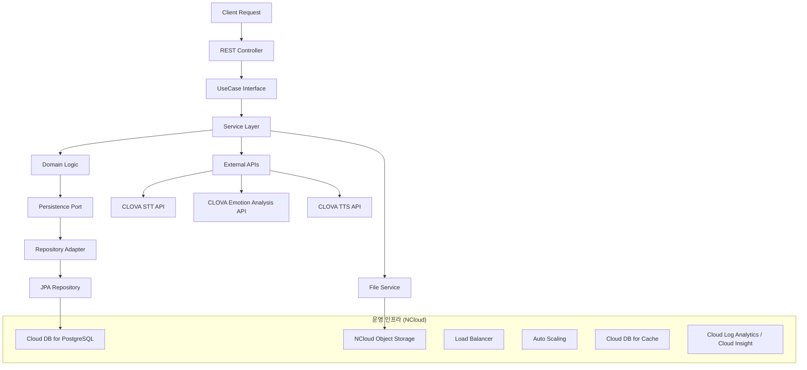

---

# melog-be

## 1. 프로젝트 소개

Melog 백엔드 API 서버입니다.
사용자가 텍스트 또는 음성으로 감정을 기록하면, AI가 이를 분석하여 월별 통계와 인사이트를 제공하는 **AI 감정 다이어리 서비스**입니다.

본 서비스는 **NCloud 인프라와 Clova AI API**를 기반으로 개발되었으며, 단순 기록을 넘어 **AI 기반 감정 분석 및 음성 인터랙션**을 제공합니다.

---

## 2. NCloud + Clova 서비스 활용


*Melog는 **NCloud의 다양한 인프라·AI 서비스를 종합적으로 활용**하여 구축되었습니다.*

* **Compute**

  * NCloud **Server (VPC)** – Spring Boot 백엔드 서버 운영
  * **Auto Scaling** – 무중단 확장 대응
* **Database**

  * **Cloud DB for PostgreSQL (VPC)** – 감정 기록 데이터 저장
  * **Cloud DB for Cache** – 감정 분석 결과 및 통계 캐싱
* **Storage**

  * **Object Storage** – 음성 파일 및 분석 리소스 저장
* **AI Services**

  * **Clova Studio** – 감정 분석, 요약, 키워드 추출
  * **Clova Speech Recognition (CSR)** – STT (음성 → 텍스트 변환)
  * **Clova Voice Premium** – TTS (감정 기반 음성 합성)
* **Networking**

  * **VPC + Public IP** – 안전한 네트워크 구성
  * **Load Balancer** – 대규모 트래픽 분산
* **Monitoring**

  * **Cloud Log Analytics / Cloud Insight** – 성능 모니터링 및 장애 대응

---

## 3. AI 서비스 차별성

Melog는 단순 CRUD 서버가 아닌, **Clova AI와 긴밀히 통합된 AI 중심 서비스**입니다.

* **STT → 감정 분석 → TTS 완전 자동화**
* **3단계 대화 요약** (공감 → 돌아보기 → 위로/조언)
* **감정 점수 + 키워드 추출 + 위로 멘트 자동 매핑**
* **실시간 AI 피드백** (분석 즉시 음성/텍스트 응답 제공)

➡️ 이를 통해 **단순 일기 서비스 → AI 감정 케어 플랫폼**으로 발전합니다.

---

## 4. AI 기능 고도화

### 4.1 Prompt Engineering (Clova Studio)

* 사용자별 감정 패턴을 반영한 **맞춤형 요약/피드백**
* Function Calling으로 **JSON 응답 일관성 보장**
* 3단계 대화 구조를 강제하여 상담형 요약문 생성

### 4.2 Clova Voice

* 감정 점수를 음성 파라미터에 매핑하여 **감정 기반 TTS 제공**
* 기쁨, 설렘, 슬픔, 분노 등 감정을 음성 톤에 반영
* 음성 UI 기반 감정 피드백 서비스로 확장

### 4.3 감정 코멘트 자동 매핑

* 감정 점수(0\~100)를 5단계로 분류하여 **맞춤형 위로 멘트 제공**
* DB에 저장된 멘트를 자동 매핑, 개인화된 피드백 강화

### 4.4 AI 파이프라인 통합

* **STT → 감정 분석 → TTS** 전체 플로우 자동화
* 음성 입력부터 음성 응답까지 자연스러운 AI 인터랙션 제공

---

## 5. 개발 구조 및 운영 아키텍처

본 프로젝트는 **헥사고날 아키텍처(Ports & Adapters)** 기반으로 설계되어 유지보수성과 확장성을 확보했습니다.
또한 NCloud 인프라의 **Auto Scaling, Load Balancer, Cloud DB Cache**를 통합하여 **무중단 운영 및 성능 최적화**를 보장합니다.



**핵심 운영 전략**

* **캐싱 최적화**: Cloud DB for Cache 활용 → 감정 분석 결과 캐싱
* **트래픽 대응**: Auto Scaling + Load Balancer → 무중단 확장
* **모니터링**: Cloud Log Analytics & Insight → 성능·장애 대응

---

## 7. AI 감정분석 성능개선

### 🔧1차 성능개선 (재시도 로직 최적화)

#### 🔍 기존 상황

- **응답시간**: 평균 18초(텍스트 기준)
- **문제점**: API 일관성 확보를 위한 3번 재시도 로직으로 인한 지연
- **구조**: 재시도마다 품질 검증 및 보정 로직 반복

#### 💡 개선 방안

1. **재시도 로직 단순화**: 3번 → 1번 시도로 변경
2. **프롬프트 통합**: 기존 3번 재시도용 프롬프트를 하나로 결합
3. **토큰 최적화**: `maxTokens`를 4096으로 최대 설정

#### ⚙️ 기술적 설정

```java
"maxTokens", 4096,        // 최대 토큰으로 설정 (더 긴 응답)
"temperature", 0.2,       // 창의성과 일관성의 균형
"topP", 0.8,             // 더 다양한 표현
"frequencyPenalty", 0.1,  // 반복 방지
"presencePenalty", 0.3    // 다양성 증가
```

#### 개선 결과

- **평균 응답시간**: 18초 → 6초 (**67% 단축**)
- **품질**: 재시도 대비 가성비 있는 결과 품질 달성

---

### 🔧 2차 성능개선 (응답 처리 방식 혁신)

#### 🔍 기존 문제점

- **Function Calling**: 복잡한 구조로 인한 파싱 오류 발생
- **JSON 응답**: AI가 JSON 형식으로 응답 시 구조 오류로 인한 재시도
- **품질 저하**: 1번 시도로 인한 낮은 품질의 요약본

#### 💡 혁신적 개선 방안

1. **응답 방식 전환**: JSON → 자연스러운 텍스트 응답
2. **서버 파싱**: AI 응답을 서버에서 분석하여 JSON 구조 생성
3. **Function Calling 강화**: 더 정교한 프롬프트로 일관성 확보

#### ⚙️ 핵심 기술 변경

```java
// 기존: AI가 JSON 반환 → 파싱 오류
// 개선: AI가 자연스러운 텍스트 반환 → 서버에서 파싱

private String cleanTextContent(String text) {
    return text
        .replaceAll("\\\\n+", " ")           // 줄바꿈 정리
        .replaceAll("\\\\s+", " ")           // 연속 공백 정리
        .trim();                           // 앞뒤 공백 제거
}
```

---

#### 1차 + 2차 성능 개선 적용한 품질 향상 결과

- **기존 요약 (1차 개선)**

```
"안녕? 오늘은 라면에 소세지를 곁들여서 정말 맛있게 먹었구나. 문어 육수 라면이 없어서 조금 아쉬운 마음이 들었을 것 같아. 그래도 소세지의 맛이 너에게 큰 기쁨을 줘서 다행이야. 문어를 못 먹게 되어 속상했을 텐데, 그 마음 충분히 이해해. 이젠 좋아하는 노래를 들으며 코딩에 집중하는 시간을 가지며 마음을 달래보는 건 어떨까? 가끔 계획대로 되지 않는 일들이 있지만, 그럴 때마다 작은 즐거움을 찾아내는 것도 중요하니까 말이야. 오늘 하루도 수고 많았고, 앞으로도 네가 원하는 것들을 차근차근 이뤄나가길 바랄게"
```

- **개선된 요약 (2차 개선)**

```
"아, 오늘은 정말 아무 일도 없이 그저 누워서 핸드폰만 본 하루였네요. 유튜브와 틱톡에 빠져서 시간 가는 줄 몰랐어요. 그런데도 한편으로는 이렇게 보내는 시간이 오히려 행복하지 않나 싶은 생각도 들고, 참 모순적인 감정이 드는 하루였던 것 같아요. 하루 종일 누워 있으면서 느꼈던 편안함과 동시에 시간을 낭비한 듯한 찝찝함이 공존했던 순간들을 떠올려보면, 다양한 감정이 얽혀 있었던 것 같아요. 유튜브와 틱톡에서 재미있는 영상을 보며 웃음을 터뜨리고 즐거움을 느끼면서도, 문득문득 떠오르는 '이렇게 시간을 보내도 될까?'라는 생각이 마음을 어지럽혔겠죠. 하지만 결국 중요한 건 스스로에게 어떤 방식이 가장 편안한지를 찾는 과정이라고 생각해요. 그러니 너무 자책하지 말고, 가끔은 자신에게 휴식을 주는 것도 필요해요. 오늘의 경험이 앞으로 더 나은 균형을 찾는 데 도움이 될 거예요. 다음에는 조금 더 생산적인 활동을 해보는 것도 좋지만, 오늘은 충분히 잘 쉬었다고 스스로를 다독여 주세요. 작은 행복들이 모여 큰 행복을 이루니까요. 언제나 자신을 믿고 천천히 나아가길 바랄게요. 😊"
```

---

### 최종 성능 지표

| 구분 | 기존 | 1차 개선 | 2차 개선 | 개선율 |
| --- | --- | --- | --- | --- |
| **응답시간** | 18초 | 6초 | 6초 | **67% 단축** |
| **재시도 횟수** | 3회 | 1회 | 1회 | **67% 감소** |
| **응답 품질** | 높음 | 중간 | 높음 | **품질 복원** |
| **안정성** | 높음 | 높음 | **매우 높음** | **향상** |

---

### 추가 안정성 강화

감정분석이 실패해도 감정이 등록되는 문제가 있었음.

아래 설정 후, 문제해결

#### 트랜잭션 롤백 설정

```java
@Transactional(rollbackFor = Exception.class)
public EmotionRecord createEmotionRecordFromText(String nickname, EmotionRecordCreateRequest request)
```

- **감정분석 실패 시**: 트랜잭션 롤백으로 데이터 일관성 보장
- **사용자 경험**: 에러 발생 시에도 안전한 재등록 가능

---

## 8. 향후 발전 및 비즈니스 확장 계획

Melog는 단순 기록 서비스에 그치지 않고, **실제 비즈니스로 확장 가능한 AI 감정 케어 플랫폼**을 목표로 합니다.

### 6.1 기능 확장 계획

* **Clova OCR**

  * 손글씨 일기·메모를 촬영하여 텍스트 추출 → 감정 분석 확장
  * 멀티모달 감정 분석(텍스트 + 음성 + 이미지) 서비스로 발전
* **AI 개인화 고도화**

  * 사용자별 감정 히스토리 학습
  * 맞춤형 리포트·코칭 제공

### 6.2 서비스 모델 확장

* **B2C 모델 (개인 사용자)**

  * 월 구독 기반 감정 다이어리 서비스
  * 개인화된 감정 리포트, 음성 코칭 제공
* **B2B SaaS 모델 (기업 고객)**

  * 콜센터: 고객 감정 분석 API 제공 → 상담 품질 개선
  * 헬스케어: 감정 기록 기반 스트레스·멘탈 모니터링 API
  * 교육/복지 기관: 아동·노인 대상 감정 관리 솔루션

### 6.3 기술적 성장 전략

* **오토스케일링 + 캐싱**으로 글로벌 사용자 대응
* **멀티클라우드 확장** (해외 리전에 맞춘 배포)
* **AI 파트너십**: NCloud AI 생태계 내 서비스와 통합

### 6.4 장기 비전

* **Emotion-as-a-Service (EaaS)**

  * 감정 데이터 API를 타 SaaS, 메타버스, 게임 등에 제공
* **AI 기반 심리 웰빙 플랫폼**

  * 음성·텍스트·이미지 통합 분석
  * 감정 케어 + 커뮤니티 기능 통합

---


