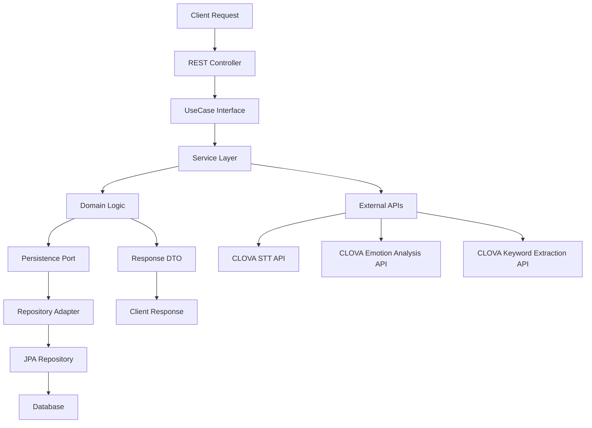

# melog-be

## 프로젝트 소개
Melog 백엔드 API 서버입니다. 감정 기록 및 분석을 위한 RESTful API를 제공합니다.

## 개발 환경
- Java 17
- Spring Boot
- Gradle
- PostgreSQL
- JPA/Hibernate

## 개발자
- whooseong

## 시작하기
```bash
./gradlew bootRun
```

## 작업 내용 (whooseong 브랜치)

### 1. 작업 내용 요약
- **도메인 엔티티 구현 완료**: ERD 기반으로 User, EmotionRecord, EmotionScore, UserSelectedEmotion, EmotionKeyword 엔티티 구현
- **도메인 중심 헥사고날 아키텍처 적용**: Ports & Adapters 패턴으로 도메인별 구조 재구성
- **API 명세 구현 완료**: API 명세에 맞는 RESTful API 엔드포인트 구현
- **Repository 계층 구현**: JPA 기반 데이터 접근 계층 구현
- **Service 계층 구현**: 비즈니스 로직 처리 서비스 구현
- **Controller 계층 구현**: REST API 컨트롤러 구현

### 2. 주요 기능 요약

- **사용자 관리**: 사용자 등록, 조회, 수정, 삭제 기능
- **감정 기록 관리**: 감정 등록, 조회, 수정, 삭제 기능
- **감정 분석**: 텍스트 기반 감정 분석 및 키워드 추출
- **캘린더 조회**: 월별 감정 기록 캘린더 뷰
- **통계 및 차트**: 월별 감정 분포 통계 및 차트 데이터
- **인사이트 제공**: 월별 키워드 및 요약 정보

### 3. 전체 흐름을 표현한 Mermaid 플로우차트



## 상세 코드 분석

### 1. 시스템 전체 흐름 요약

이 프로젝트는 Spring Boot와 JPA를 기반으로 한 백엔드 API 서버로, 감정 기록 및 분석을 위한 시스템입니다. 시스템의 주요 흐름은 다음과 같습니다:

1. **API 요청 처리**: 클라이언트가 REST API 엔드포인트를 호출하면 Spring Boot의 컨트롤러가 요청을 받아 처리합니다.

2. **비즈니스 로직 처리**: 컨트롤러는 UseCase 인터페이스를 통해 서비스 계층의 비즈니스 로직을 호출합니다.

3. **데이터 접근**: 서비스 계층은 Persistence Port를 통해 데이터 접근 계층과 상호작용하여 데이터를 조회하거나 저장합니다.

4. **외부 API 연동**: 감정 분석, STT, 키워드 추출 등의 기능은 외부 CLOVA API와 연동하여 처리합니다.

5. **응답 반환**: 처리된 결과는 DTO를 통해 클라이언트에게 JSON 형태로 반환됩니다.

### 2. 주요 기능 요약

- **사용자 관리**: 닉네임 기반 사용자 등록, 조회, 수정, 삭제
- **감정 기록 관리**: 텍스트 기반 감정 기록 생성, 조회, 수정, 삭제
- **감정 분석**: 외부 API를 통한 감정 분석 및 키워드 추출
- **캘린더 기능**: 월별 감정 기록 캘린더 뷰 제공
- **통계 기능**: 월별 감정 분포 통계 및 차트 데이터 제공
- **인사이트 기능**: 월별 키워드 및 요약 정보 제공

### 3. 아키텍처 구조

```
src/main/java/com/melog/melog/
├── user/                         # 사용자 도메인
│   ├── domain/                  # 사용자 도메인 엔티티 및 모델
│   │   ├── model/              # DTO 모델
│   │   │   ├── request/        # 요청 DTO
│   │   │   │   ├── UserCreateRequest.java
│   │   │   │   └── UserUpdateRequest.java
│   │   │   └── response/       # 응답 DTO
│   │   │       └── UserResponse.java
│   │   └── User.java           # 사용자 엔티티
│   ├── application/             # 사용자 애플리케이션 계층
│   │   ├── port/
│   │   │   ├── in/             # UseCase 인터페이스
│   │   │   │   └── UserUseCase.java
│   │   │   └── out/            # PersistencePort 인터페이스
│   │   │       └── UserPersistencePort.java
│   │   └── service/            # 서비스 구현체
│   │       └── UserService.java
│   └── adapter/                # 사용자 어댑터 계층
│       ├── in/
│       │   └── web/            # 컨트롤러
│       │       └── UserController.java
│       └── out/
│           └── persistence/    # 데이터 접근 어댑터
│               ├── UserPersistenceAdapter.java
│               └── UserJpaRepository.java
├── emotion/                     # 감정 도메인
│   ├── domain/                  # 감정 도메인 엔티티 및 모델
│   │   ├── model/              # DTO 모델
│   │   │   ├── request/        # 요청 DTO
│   │   │   │   ├── EmotionRecordCreateRequest.java
│   │   │   │   ├── EmotionRecordSelectRequest.java
│   │   │   │   └── EmotionRecordTextUpdateRequest.java
│   │   │   └── response/       # 응답 DTO
│   │   │       ├── EmotionRecordResponse.java
│   │   │       ├── EmotionScoreResponse.java
│   │   │       ├── UserSelectedEmotionResponse.java
│   │   │       ├── EmotionKeywordResponse.java
│   │   │       ├── EmotionCalendarResponse.java
│   │   │       ├── EmotionChartResponse.java
│   │   │       ├── EmotionInsightResponse.java
│   │   │       ├── EmotionListResponse.java
│   │   │       └── EmotionRecordSummaryResponse.java
│   │   ├── EmotionRecord.java  # 감정 기록 엔티티
│   │   ├── EmotionScore.java   # 감정 점수 엔티티
│   │   ├── UserSelectedEmotion.java # 사용자 선택 감정 엔티티
│   │   ├── EmotionKeyword.java # 감정 키워드 엔티티
│   │   └── EmotionType.java    # 감정 타입 enum
│   ├── application/             # 감정 애플리케이션 계층
│   │   ├── port/
│   │   │   ├── in/             # UseCase 인터페이스
│   │   │   │   └── EmotionRecordUseCase.java
│   │   │   └── out/            # PersistencePort 인터페이스
│   │   │       ├── EmotionRecordPersistencePort.java
│   │   │       ├── EmotionScorePersistencePort.java
│   │   │       ├── UserSelectedEmotionPersistencePort.java
│   │   │       └── EmotionKeywordPersistencePort.java
│   │   └── service/            # 서비스 구현체
│   │       └── EmotionRecordService.java
│   └── adapter/                # 감정 어댑터 계층
│       ├── in/
│       │   └── web/            # 컨트롤러
│       │       └── EmotionRecordController.java
│       └── out/
│           └── persistence/    # 데이터 접근 어댑터
│               ├── EmotionRecordPersistenceAdapter.java
│               ├── EmotionRecordJpaRepository.java
│               ├── EmotionScorePersistenceAdapter.java
│               ├── EmotionScoreJpaRepository.java
│               ├── UserSelectedEmotionPersistenceAdapter.java
│               ├── UserSelectedEmotionJpaRepository.java
│               ├── EmotionKeywordPersistenceAdapter.java
│               └── EmotionKeywordJpaRepository.java
└── common/                      # 공통 모듈
    ├── exception/               # 예외 처리
    │   └── GlobalExceptionHandler.java
    └── config/                  # 설정
        └── RestTemplateConfig.java
```

### 4. 주요 클래스 설명

#### User Domain Layer
- **User**: 사용자 엔티티 (id, nickname, createdAt)
- **UserUseCase**: 사용자 관련 비즈니스 로직 인터페이스
- **UserPersistencePort**: 사용자 데이터 접근 인터페이스
- **UserService**: 사용자 서비스 구현체
- **UserController**: 사용자 관련 REST API 컨트롤러
- **UserPersistenceAdapter**: 사용자 데이터 접근 어댑터

#### Emotion Domain Layer
- **EmotionRecord**: 감정 기록 엔티티 (text, summary, date, user)
- **EmotionScore**: 감정 분석 결과 엔티티 (emotionType, percentage, step)
- **UserSelectedEmotion**: 사용자 선택 감정 엔티티
- **EmotionKeyword**: 감정 키워드 엔티티
- **EmotionType**: 감정 타입 enum (기쁨, 분노, 슬픔, 평온, 설렘, 지침)
- **EmotionRecordUseCase**: 감정 기록 관련 비즈니스 로직 인터페이스
- **EmotionRecordService**: 감정 기록 서비스 구현체
- **EmotionRecordController**: 감정 기록 관련 REST API 컨트롤러

#### Common Layer
- **DTO Models**: 요청/응답 데이터 전송 객체
- **GlobalExceptionHandler**: 전역 예외 처리
- **RestTemplateConfig**: 외부 API 연동 설정

### 5. API 엔드포인트

#### 사용자 관련 API
- `POST /api/users` - 사용자 등록
- `GET /api/users/{nickname}` - 사용자 조회
- `PUT /api/users/{nickname}` - 사용자 수정
- `DELETE /api/users/{nickname}` - 사용자 삭제

#### 감정 기록 관련 API
- `POST /api/users/{nickname}/emotions` - 감정 등록 및 분석
- `PUT /api/users/{nickname}/emotions/{id}/select` - 감정 선택 확정
- `PUT /api/users/{nickname}/emotions/{id}/text` - 텍스트 수정
- `GET /api/users/{nickname}/emotions/{id}` - 감정 상세 조회
- `DELETE /api/users/{nickname}/emotions/{id}` - 감정 기록 삭제
- `GET /api/users/{nickname}/emotions/calendar` - 캘린더 조회
- `GET /api/users/{nickname}/emotions/summary/chart` - 차트 데이터
- `GET /api/users/{nickname}/emotions/summary/insight` - 인사이트
- `GET /api/users/{nickname}/emotions` - 감정 기록 리스트


