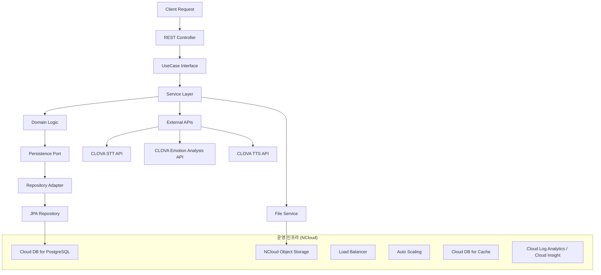

---

# melog-be

## 1. 프로젝트 소개

Melog 백엔드 API 서버입니다.
사용자가 텍스트 또는 음성으로 감정을 기록하면, AI가 이를 분석하여 월별 통계와 인사이트를 제공하는 **AI 감정 다이어리 서비스**입니다.

본 서비스는 **NCloud 인프라와 Clova AI API**를 기반으로 개발되었으며, 단순 기록을 넘어 **AI 기반 감정 분석 및 음성 인터랙션**을 제공합니다.

---

## 2. NCloud + Clova 서비스 활용

Melog는 **NCloud의 다양한 인프라·AI 서비스를 종합적으로 활용**하여 구축되었습니다.

* **Compute**

  * NCloud **Server (VPC)** – Spring Boot 백엔드 서버 운영
  * **Auto Scaling** – 무중단 확장 대응
* **Database**

  * **Cloud DB for PostgreSQL (VPC)** – 감정 기록 데이터 저장
  * **Cloud DB for Cache** – 감정 분석 결과 및 통계 캐싱
* **Storage**

  * **Object Storage** – 음성 파일 및 분석 리소스 저장
* **AI Services**

  * **Clova Studio** – 감정 분석, 요약, 키워드 추출
  * **Clova Speech Recognition (CSR)** – STT (음성 → 텍스트 변환)
  * **Clova Voice Premium** – TTS (감정 기반 음성 합성)
* **Networking**

  * **VPC + Public IP** – 안전한 네트워크 구성
  * **Load Balancer** – 대규모 트래픽 분산
* **Monitoring**

  * **Cloud Log Analytics / Cloud Insight** – 성능 모니터링 및 장애 대응

---

## 3. AI 서비스 차별성

Melog는 단순 CRUD 서버가 아닌, **Clova AI와 긴밀히 통합된 AI 중심 서비스**입니다.

* **STT → 감정 분석 → TTS 완전 자동화**
* **3단계 대화 요약** (공감 → 돌아보기 → 위로/조언)
* **감정 점수 + 키워드 추출 + 위로 멘트 자동 매핑**
* **실시간 AI 피드백** (분석 즉시 음성/텍스트 응답 제공)

➡️ 이를 통해 **단순 일기 서비스 → AI 감정 케어 플랫폼**으로 발전합니다.

---

## 4. AI 기능 고도화

### 4.1 Prompt Engineering (Clova Studio)

* 사용자별 감정 패턴을 반영한 **맞춤형 요약/피드백**
* Function Calling으로 **JSON 응답 일관성 보장**
* 3단계 대화 구조를 강제하여 상담형 요약문 생성

### 4.2 Clova Voice

* 감정 점수를 음성 파라미터에 매핑하여 **감정 기반 TTS 제공**
* 기쁨, 설렘, 슬픔, 분노 등 감정을 음성 톤에 반영
* 음성 UI 기반 감정 피드백 서비스로 확장

### 4.3 감정 코멘트 자동 매핑

* 감정 점수(0\~100)를 5단계로 분류하여 **맞춤형 위로 멘트 제공**
* DB에 저장된 멘트를 자동 매핑, 개인화된 피드백 강화

### 4.4 AI 파이프라인 통합

* **STT → 감정 분석 → TTS** 전체 플로우 자동화
* 음성 입력부터 음성 응답까지 자연스러운 AI 인터랙션 제공

---

## 5. 개발 구조 및 운영 아키텍처

본 프로젝트는 **헥사고날 아키텍처(Ports & Adapters)** 기반으로 설계되어 유지보수성과 확장성을 확보했습니다.
또한 NCloud 인프라의 **Auto Scaling, Load Balancer, Cloud DB Cache**를 통합하여 **무중단 운영 및 성능 최적화**를 보장합니다.

**핵심 운영 전략**

* **캐싱 최적화**: Cloud DB for Cache 활용 → 감정 분석 결과 캐싱
* **트래픽 대응**: Auto Scaling + Load Balancer → 무중단 확장
* **모니터링**: Cloud Log Analytics & Insight → 성능·장애 대응

---

## 6. 향후 발전 및 비즈니스 확장 계획

Melog는 단순 기록 서비스에 그치지 않고, **실제 비즈니스로 확장 가능한 AI 감정 케어 플랫폼**을 목표로 합니다.

### 6.1 기능 확장 계획

* **Clova OCR**

  * 손글씨 일기·메모를 촬영하여 텍스트 추출 → 감정 분석 확장
  * 멀티모달 감정 분석(텍스트 + 음성 + 이미지) 서비스로 발전
* **AI 개인화 고도화**

  * 사용자별 감정 히스토리 학습
  * 맞춤형 리포트·코칭 제공

### 6.2 서비스 모델 확장

* **B2C 모델 (개인 사용자)**

  * 월 구독 기반 감정 다이어리 서비스
  * 개인화된 감정 리포트, 음성 코칭 제공
* **B2B SaaS 모델 (기업 고객)**

  * 콜센터: 고객 감정 분석 API 제공 → 상담 품질 개선
  * 헬스케어: 감정 기록 기반 스트레스·멘탈 모니터링 API
  * 교육/복지 기관: 아동·노인 대상 감정 관리 솔루션

### 6.3 기술적 성장 전략

* **오토스케일링 + 캐싱**으로 글로벌 사용자 대응
* **멀티클라우드 확장** (해외 리전에 맞춘 배포)
* **AI 파트너십**: NCloud AI 생태계 내 서비스와 통합

### 6.4 장기 비전

* **Emotion-as-a-Service (EaaS)**

  * 감정 데이터 API를 타 SaaS, 메타버스, 게임 등에 제공
* **AI 기반 심리 웰빙 플랫폼**

  * 음성·텍스트·이미지 통합 분석
  * 감정 케어 + 커뮤니티 기능 통합

---

